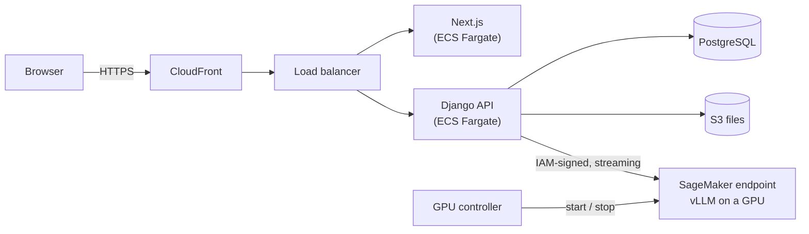

<div align="center">

# Private LLM Chat on AWS SageMaker

**Your own ChatGPT, on your own GPU, in your own AWS account.**

Deploy open-source LLMs (Qwen, Llama, Gemma, DeepSeek...) on Amazon SageMaker with
vLLM, and put a real ChatGPT-style app in front of them: accounts with Google sign-in
and two-factor auth, streaming chat, documents and images, OCR, and a GPU that switches
itself off when nobody is using it.

[](https://github.com/codewithmuh/private-llm-chat-sagemaker-aws/actions/workflows/ci.yml)
[](LICENSE)


[Quick start](#quick-start-5-minutes-no-gpu) ·
[Learning path](#choose-your-path) ·
[Architecture](docs/architecture.md) ·
[Deploy on AWS](docs/04-deploy-the-full-stack-on-aws.md) ·
[Docs](docs/)

</div>

---

## Why this exists

Sending company documents, customer data or private notes to a third-party AI API is
often not an option. Running the model yourself is, but the path from "I have an AWS
account" to "my team has a private ChatGPT" is scattered across a hundred blog posts.

This repository is that path in one place, **from a laptop demo to a production
deployment**, with every step explained:

- 🔒 **Private by design.** The model, the database and the files stay in your AWS
  account and region. The model endpoint has no public URL; only your app's IAM role
  can call it. Prompts are never logged.
- 💸 **Cost-aware.** GPU endpoints start when someone sends a message and are deleted
  after 30 idle minutes. A forgotten GPU is the #1 surprise bill; here it can't happen
  by accident.
- 🧩 **Any model.** Pick a preset or any Hugging Face model vLLM supports. Swap models
  without touching the app. The same app also talks to Ollama, LM Studio or any
  OpenAI-compatible server.
- 🎓 **Made for learning.** Beginner-friendly guides, code that explains *why*, and a
  mock model so you can run everything without a GPU on day one.

## Features

| | |
|---|---|
| **Chat** | Streaming answers, conversation history with search, rename and pin, regenerate, stop, Markdown with code highlighting, tables and math, per-user custom instructions, model picker, dark mode |
| **Documents & images** | Attach PDFs, Word files, text and code. Their text goes into the prompt, trimmed to fit the model's context window. Images go to vision models as pictures |
| **OCR** | Extract text from photos, screenshots and scanned PDFs with a vision LLM, falling back to Tesseract on the CPU. Copy, download, or chat about the result |
| **Accounts** | Email + password with email verification, password reset, **Sign in with Google**, **two-factor auth** with an authenticator app (TOTP) or email codes, recovery codes |
| **Models** | SageMaker endpoints (AWS's vLLM container: nothing to build), OpenAI-compatible servers (vLLM, Ollama, LM Studio), a mock for development; several models on one GPU with the included router |
| **GPU control** | Per model: `on_demand` (start when used, delete when idle), `always_on`, `off`, or `manual`. Status is shown live in the UI and the admin |
| **AWS infrastructure** | Terraform: CloudFront (HTTPS), ALB, ECS Fargate (ARM), RDS PostgreSQL, private S3, SES email, SageMaker, GitHub Actions with OIDC |
| **Developer experience** | `make up` for the whole stack in Docker, Mailpit to see emails, 90+ backend tests, CI for backend, frontend, Terraform and Docker builds |

## Architecture



When you press **Send**: the API checks the model's GPU is up, builds the prompt
(conversation history, your files, your instructions, trimmed to fit), streams the
request to the model, and relays each token to your browser as Server-Sent Events.
Details and diagrams: [docs/architecture.md](docs/architecture.md).

## Choose your path

Each level builds on the previous one. Stop wherever you have what you need.

| Level | You get | Time | Cost | Guide |
|---|---|---|---|---|
| **1. Local** | The full app on your laptop with a mock model | 5 min | free | [01-quickstart-local](docs/01-quickstart-local.md) |
| **2. Real model, locally** | Chat with Qwen / Llama running on your machine (Ollama) | 15 min | free | [02-run-a-real-model-locally](docs/02-run-a-real-model-locally.md) |
| **3. Your GPU on SageMaker** | A private LLM endpoint in your AWS account, used by the local app | 30 min | ~$1–2 per GPU hour | [03-deploy-a-model-on-sagemaker](docs/03-deploy-a-model-on-sagemaker.md) |
| **4. Everything on AWS** | The app on a public HTTPS URL for your team, GPU on demand | 1–2 h | ~$60/month + GPU hours | [04-deploy-the-full-stack-on-aws](docs/04-deploy-the-full-stack-on-aws.md) |
| **5. Advanced** | Scale to zero, weights in S3 with no internet, several models per GPU, 70B models, CI/CD | — | — | [05-advanced](docs/05-advanced.md) |

## Quick start (5 minutes, no GPU)

You need Docker.

```bash
git clone https://github.com/codewithmuh/private-llm-chat-sagemaker-aws.git
cd private-llm-chat-sagemaker-aws
make up
```

- Chat app: **http://localhost:3000** (sign up; the verification code arrives in Mailpit)
- Emails: **http://localhost:8025**
- API and admin: **http://localhost:8000/admin/**

The default model is a mock that streams a description of what the backend sent it,
the best way to see what a model actually receives. Then try a real one:
[Ollama](docs/02-run-a-real-model-locally.md) or [SageMaker](docs/03-deploy-a-model-on-sagemaker.md).

## Deploy a model to SageMaker in three commands

```bash
pip install boto3                                  # plus AWS credentials and GPU quota
python ml/sagemaker/deploy.py deploy qwen3-vl-8b   # ~10-15 min to "InService"
python ml/sagemaker/deploy.py chat llmchat-qwen3-vl-8b "Hello! What can you do?"
python ml/sagemaker/deploy.py stop llmchat-qwen3-vl-8b   # stop paying
```

It uses AWS's own vLLM container, so there is nothing to build. The script is ~300
commented lines: read it to see exactly how SageMaker hosting works
(Model → EndpointConfig → Endpoint).

## Deploy everything to AWS

```bash
cp infra/terraform/terraform.tfvars.example infra/terraform/terraform.tfvars   # edit it
make tf-init tf-apply     # network, database, storage, CloudFront, ECS, SageMaker config
make deploy               # build + push the images, roll them out
```

Full walkthrough, including GPU quota, Google OAuth and SES setup:
[docs/04-deploy-the-full-stack-on-aws.md](docs/04-deploy-the-full-stack-on-aws.md).
Cost breakdown: [docs/cost.md](docs/cost.md).

## Models

| Preset | Model | GPU | ~$/hour | Vision/OCR |
|---|---|---|---|---|
| `qwen3-vl-8b` ⭐ | Qwen3-VL 8B FP8 | ml.g6e.xlarge (L40S 48 GB) | 2.2 | ✅ |
| `qwen3-vl-4b` | Qwen3-VL 4B | ml.g6.xlarge (L4 24 GB) | 1.0 | ✅ |
| `qwen3-8b` | Qwen3 8B FP8 (reasoning) | ml.g6.xlarge | 1.0 | |
| `llama-3.1-8b` | Llama 3.1 8B Instruct | ml.g5.xlarge (A10G 24 GB) | 1.4 | |
| `gemma-3-12b` | Gemma 3 12B | ml.g6e.xlarge | 2.2 | ✅ |
| `qwen3-32b` | Qwen3 32B FP8 | ml.g6e.2xlarge | 2.7 | |
| `llama-3.3-70b` | Llama 3.3 70B (4 GPUs) | ml.g6e.12xlarge | 13.1 | |

…or any model vLLM supports. How to size the GPU and add your own:
[docs/models.md](docs/models.md).

## Repository layout

```
├── backend/            Django REST API: accounts & 2FA, chat streaming, files & OCR,
│                       model providers, GPU controller (+ tests)
├── frontend/           Next.js ChatGPT-style UI
├── ml/
│   ├── sagemaker/      deploy.py: deploy a model to SageMaker by hand
│   ├── models/         catalog.json: tested model presets
│   ├── mock/           fake model server (OpenAI + SageMaker contracts), for dev
│   └── vllm-router/    several models on one GPU (advanced)
├── infra/terraform/    the whole AWS stack as code
├── scripts/            deploy, GPU start/stop, state bucket, weight staging
├── config/             model lists for local development
├── docs/               guides (01–05) and reference
├── docker-compose.yml  local stack: web, api, postgres, mailpit, mock-llm (+ ollama)
└── Makefile            `make help` lists everything
```

## Tech stack

| Layer | Choice | Why |
|---|---|---|
| Model serving | **vLLM** on **SageMaker** real-time endpoints | Fast (continuous batching, paged attention), OpenAI-compatible, runs almost every open model; SageMaker gives managed GPUs with IAM-only access |
| Backend | **Django 5.2 LTS** + Django REST Framework, gunicorn | Batteries included (auth, admin, migrations); SSE streaming with threaded workers |
| Frontend | **Next.js 16**, React 19, TypeScript | The standard for chat UIs; standalone Docker image |
| Database | **PostgreSQL** (RDS) | Users, chats, model registry |
| Files | **S3** (private) + presigned URLs | Durable and cheap; never public |
| Auth | Django auth, **pyotp** (TOTP), **google-auth** (ID tokens) | Explicit code you can read, no black box |
| Infra | **Terraform**, ECS Fargate (ARM), CloudFront, ALB, SES | Serverless containers; HTTPS with no domain needed |
| Local | Docker Compose, **Mailpit**, **Ollama** | The whole system on a laptop |

## FAQ

**Do I need a GPU on my laptop?** No. Levels 1 and 2 run on any machine (level 2 is
faster with a GPU or Apple Silicon). The GPU lives on SageMaker.

**Why SageMaker and not a plain EC2 GPU?** Managed health checks, automatic restarts,
IAM-only access to the model, and it's often where GPU quota is easier to get. The
serving container is standard vLLM, so moving to EC2, EKS or on-prem later is easy;
the app only needs an OpenAI-compatible URL (`provider: "openai"`).

**Why not Amazon Bedrock?** Bedrock is great for managed models, but you can't run
any open model you like with your own settings, and there's less to learn. A Bedrock
provider is on the [roadmap](docs/roadmap.md) for comparisons.

**How much does it cost?** The app itself is roughly **$60/month** (load balancer,
small Fargate tasks, a small RDS instance). GPUs are billed per hour while the endpoint
exists: ~$1–2.2/h for the presets above. With `on_demand` scaling you only pay for
hours actually used. See [docs/cost.md](docs/cost.md).

**Is it production ready?** It's a solid, secure base: auth with 2FA, private
networking, IAM, encrypted storage, tests and CI. Before putting company data in it,
review the settings for your needs (backups, SES production access, WAF, monitoring):
[SECURITY.md](SECURITY.md).

**Can I use it with OpenAI / another API?** Yes: any OpenAI-compatible endpoint is a
model entry with a `base_url`. Handy for comparing quality, though then data leaves
your account.

## Contributing

Contributions of all sizes are welcome: model presets you've tested, docs fixes,
features from the [roadmap](docs/roadmap.md). Start with
[CONTRIBUTING.md](CONTRIBUTING.md); `make up` and `make test` get you going.

## License

[MIT](LICENSE). Models have their own licences (Apache-2.0, Llama, Gemma...); check
each model's page before commercial use.

## Acknowledgements

Built on the shoulders of [vLLM](https://github.com/vllm-project/vllm),
[AWS Deep Learning Containers](https://github.com/aws/deep-learning-containers),
[Django](https://www.djangoproject.com/), [Next.js](https://nextjs.org/),
[Ollama](https://ollama.com), [Mailpit](https://mailpit.axllent.org/), and the teams
behind the open models.
