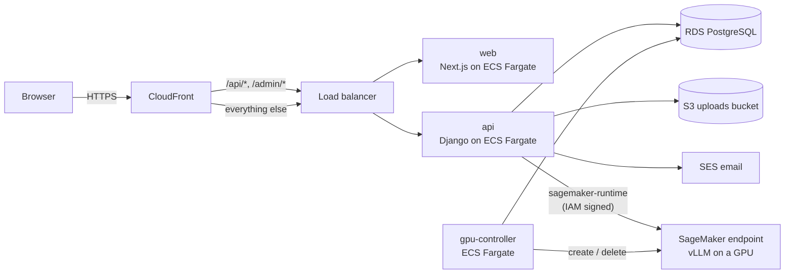
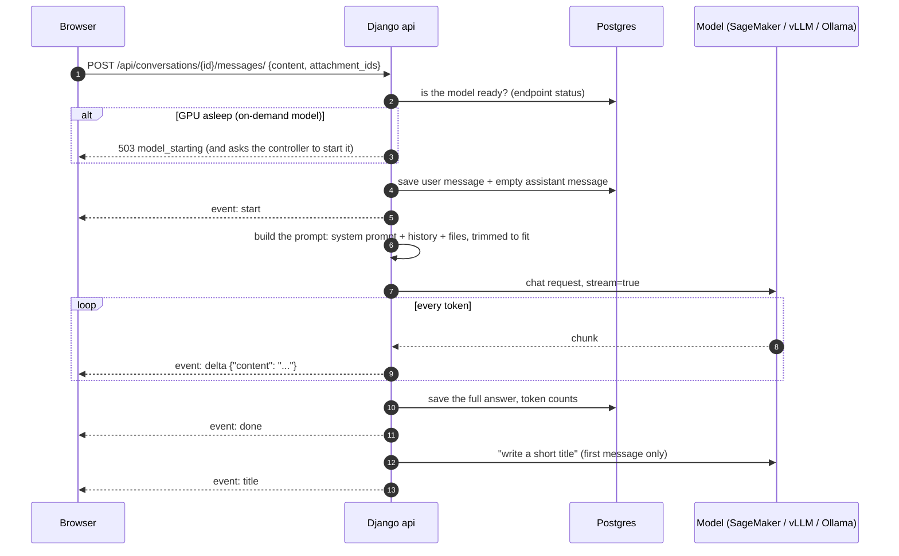
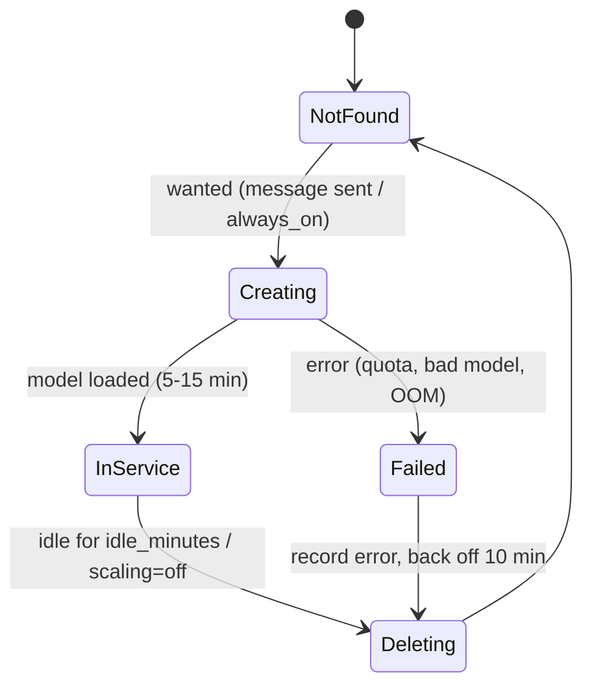
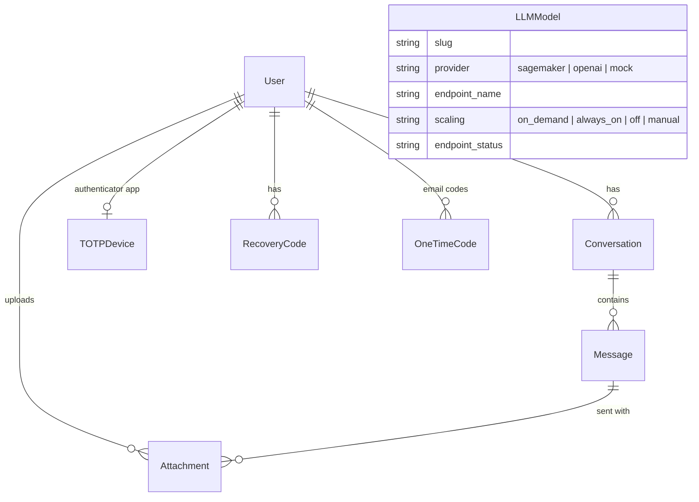

# Architecture

How the pieces fit, and what happens when you press **Send**.

## The big picture (on AWS)

| Piece | What it does | Where the code is |
|---|---|---|
| **CloudFront** | HTTPS for free on `*.cloudfront.net` (or your domain), one origin for the whole app | `infra/terraform/modules/cdn` |
| **Load balancer** | Routes `/api/*`, `/admin/*`, `/django-static/*` to Django and the rest to Next.js; only accepts traffic from CloudFront | `infra/terraform/modules/alb` |
| **web** | The chat UI. Server-renders almost nothing: pages run in the browser and call the API | `frontend/` |
| **api** | Accounts, conversations, files, prompt building, streaming answers | `backend/` |
| **gpu-controller** | Starts SageMaker endpoints when needed, deletes them when idle | `backend/apps/llm/controller.py` |
| **SageMaker endpoint** | The model: AWS's vLLM container (or `ml/vllm-router`) on a GPU instance | `infra/terraform/modules/sagemaker`, `ml/` |
| **RDS** | Users, conversations, messages, extracted file text, model registry | Django models in `backend/apps/*/models.py` |
| **S3** | Uploaded files (private bucket, presigned links) | `apps/files` + `django-storages` |

Locally, `docker compose` runs the same `web` and `api` images, with Postgres, Mailpit
and a fake model server instead of RDS, SES and SageMaker.

## What happens when you press Send

Key files, in order:

1. `apps/chat/views.py` `SendMessageView`: validates, checks the model is up
   (`apps/llm/services.ensure_ready`), saves the messages, returns a streaming
   response.
2. `apps/chat/prompting.py` `build_prompt`: turns the conversation into OpenAI-format
   messages. Documents become `<document>` blocks, images become `image_url` parts (or
   OCR text for models without vision), and the whole thing is trimmed to the model's
   context window.
3. `apps/llm/providers/*`: one class per kind of model server, all with the same
   `stream()` interface.
4. `apps/chat/streaming.py` `stream_answer`: reads the provider in a background thread,
   writes Server-Sent Events, sends keep-alive pings, saves progress, and handles Stop.

## Why these choices

**Streaming with Server-Sent Events, not WebSockets.** SSE is plain HTTP: it works
through CloudFront, load balancers and corporate proxies, needs no extra server, and
the browser reads it with `fetch()`. Chat only needs server → browser streaming.

**Sync Django + gunicorn threads, not async.** boto3 (SageMaker) is synchronous, and
threaded workers stream fine: each answer holds one thread. 2 workers × 16 threads =
32 simultaneous answers per container; add containers to scale.

**Session cookies, not JWTs in localStorage.** An `HttpOnly` cookie can't be read by
JavaScript, so an XSS bug can't steal the session. The cost is CSRF protection, which
Django provides. CloudFront puts the UI and the API on one origin, so cookies need no
cross-site settings.

**The app never talks to SageMaker over HTTP.** A SageMaker endpoint has no public URL.
Calls go through the AWS API, signed with the api task's IAM role. There's no API key to
leak, and without IAM permission in your account nobody can call your model.

**The GPU controller owns the endpoint, Terraform doesn't.** Terraform creates the model
and endpoint *configuration* (free). A GPU endpoint costs ~$1–2+/hour just by existing,
so the controller creates it when someone chats and deletes it after `idle_minutes`. If
Terraform owned it, every `apply` would recreate an endpoint the controller had
stopped.

**One prompt format everywhere.** vLLM, Ollama, LM Studio, OpenAI and SageMaker's vLLM
containers all accept the OpenAI chat-completions format. The backend builds it once;
each provider only differs in *how* it sends it.

## The GPU controller's state machine

`decide()` in `apps/llm/controller.py` is a pure function of (scaling mode, wanted?,
status, config, last use, last error), so the whole policy is readable in one place
and covered by a table test (`tests/test_controller.py`).

## Data model

Conversations store the model's **slug**, not a foreign key: a conversation outlives
the model it started with.

## Privacy by design

- Prompts and answers are **never logged**, only ids, sizes, durations and statuses.
- SageMaker **Data Capture is off** (it would copy every prompt to S3).
- Files live in a **private** bucket; the browser gets 5-minute presigned links.
- The Django admin shows conversation **metadata only**, not message text.
- Everything (model, database, files) stays in **your** AWS account and region.
