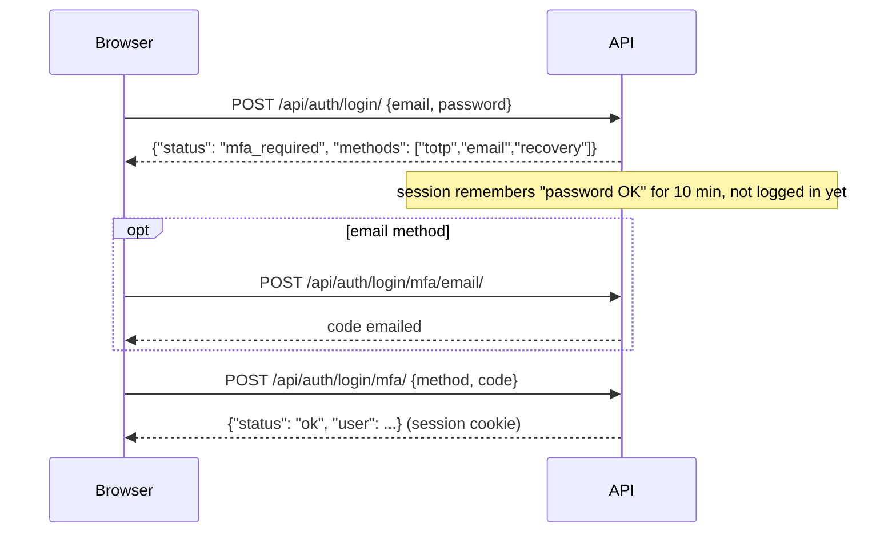

# Accounts, Google sign-in and two-factor authentication

Everything lives in `backend/apps/accounts/`, written out explicitly (no auth
framework hiding the details) so you can read how each step works. The endpoints are in
[api.md](api.md#auth--apiauth).

## Email and password

- **Sign up** → a 6-digit code is emailed → **verify** → logged in.
- Passwords are checked by Django's validators (≥ 8 characters, not common, not
  numeric, not similar to the email) and hashed with PBKDF2.
- **Forgot password** emails a link `PUBLIC_URL/reset-password?uid=…&token=…`. The
  token is Django's `default_token_generator`: it contains a hash of the current
  password, so it stops working once used.
- `EMAIL_VERIFICATION`: `mandatory` (default: no login until verified), `optional`, or
  `none`.
- `SIGNUP_ENABLED=false` makes the instance invite-only: create users in `/admin/`.

### Where do emails go?

| `EMAIL_PROVIDER` | Where | Use |
|---|---|---|
| `console` | printed in the api's logs | first run, `make backend-dev` |
| `smtp` | any SMTP server | local Docker uses **Mailpit**: http://localhost:8025 |
| `ses` | Amazon SES | production on AWS (Terraform sets it up) |

**SES sandbox:** a new SES account can only send *to* verified addresses. Verify your
own address to test, then request production access in the SES console before inviting
anyone.

## Sign in with Google

The browser shows Google's button (Google Identity Services), Google hands it a signed
**ID token**, the browser posts it to `POST /api/auth/google/`, and the backend
verifies it with Google's public keys, including that it was issued **for our client
id**. No redirects, no client secret.

Accounts are linked by email only when Google says the email is **verified**, so
nobody can take over your account by creating a Google account with your address.

### Set it up (5 minutes)

1. Go to **Google Cloud Console → APIs & Services → Credentials** (create a project if
   you have none).
2. **Configure the OAuth consent screen**: External, app name, your email. Scopes: the
   defaults (`email`, `profile`, `openid`) are enough.
3. **Create credentials → OAuth client ID → Web application**.
4. **Authorized JavaScript origins**: add every URL people open the app on:
   - `http://localhost:3000` **and** `http://localhost` for local development (Google
     asks for both when testing on localhost)
   - your CloudFront URL, e.g. `https://d1234abcd.cloudfront.net`, or your domain
5. No redirect URIs are needed.
6. Copy the **Client ID** (`….apps.googleusercontent.com`) into `GOOGLE_CLIENT_ID`: in
   `.env` locally, `google_client_id` in `terraform.tfvars` on AWS.

The frontend fetches it at runtime from `/api/config/`, so no rebuild is needed. With
no client id, the button is hidden.

## Two-factor authentication (2FA)

Enable it in **Settings → Security**. Two methods, usable together:

**Authenticator app (TOTP).** The backend generates a secret and shows it as a QR code
(`otpauth://` URI); your app (Google Authenticator, Microsoft Authenticator, 1Password,
Authy, Bitwarden...) computes a new 6-digit code every 30 seconds from that secret and
the time. The server accepts the current code and its neighbours (±30 s for clock
drift) and never the same code twice.

**Email codes.** At login, a 6-digit code is emailed. Each code: 15 minutes, 5 attempts.

**Recovery codes.** When you enable your first method you get 10 single-use codes.
Store them somewhere safe: they are the way back in if you lose your phone. You can
regenerate them (with a fresh 2FA code).

### How login works with 2FA

Google sign-in goes through the same second step: a stolen Google session is not
enough either.

**The Django admin too.** Django's own admin login form only checks a password, which
would bypass 2FA, so `/admin/login/` redirects to the app's login instead.

## Becoming an admin

Set `ADMIN_EMAILS` (comma-separated). A user whose **verified** email is listed
becomes staff + superuser the next time they log in. Or, locally,
`make superuser`.

## Security notes

- Sessions: `HttpOnly`, `SameSite=Lax`, `Secure` in production, 14 days
  (`SESSION_COOKIE_AGE`). Changing your password logs out your other sessions.
- CSRF: every state-changing request must send `X-CSRFToken`, including login and
  sign-up (login CSRF would let a malicious page log you into *its* account).
- Rate limits (per IP) on login, sign-up, codes and resets: see `DEFAULT_THROTTLE_RATES`.
- Endpoints that could reveal whether an email has an account (`resend`, `reset`)
  always answer the same way.
- One-time codes and recovery codes are stored as HMAC-SHA256 hashes keyed with
  `DJANGO_SECRET_KEY`; TOTP secrets are stored as-is (they have to be, to compute
  codes). Protect your database and its backups.
